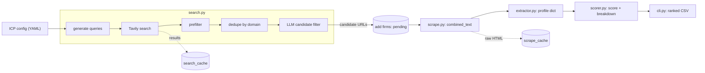
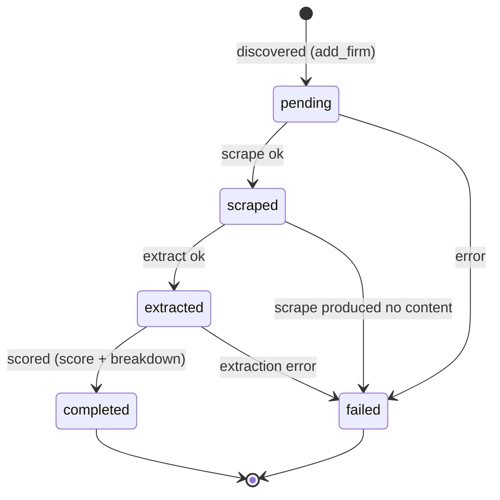

# Architecture

How the lead agent turns an ICP config into a ranked CSV of qualified leads, and
why it's built the way it is.

## Overview

The agent is a **sequential, stateful pipeline**: an Ideal Customer Profile (YAML)
goes in, a ranked CSV of scored firms comes out. Each firm advances through discrete
stages persisted in SQLite, so runs are resumable and observable.

There is **no agent framework** (no LangChain/LangGraph/CrewAI). It's plain async
Python with one module per pipeline stage. For a system whose value is in
debuggability and configurability, the framework would add indirection without
buying anything — so the stages are ordinary functions that pass plain data.

## Pipeline at a glance

Discovery is a single batch step. Everything from scrape onward runs **per firm**,
concurrently and in isolation.

## Stage-by-stage walkthrough

### 1. Discovery — `search.py`
`discover_candidates` orchestrates: **query generation** (deterministic
`templates × geo_focus` expansion, optionally LLM-augmented), **Tavily search** per
query (cached in `search_cache`), a deterministic **prefilter** (built-in directory
blocklist + the ICP's `negative_keywords` matched against host/title), **dedupe by
registrable domain** (collapses many pages of one firm to a single root URL), and a
**batched LLM candidate filter** that classifies each surviving result as a real
firm site vs. a directory/aggregator/news page. Output: a list of candidate URLs.

### 2. Scrape — `scraper.py`
`Scraper.scrape_firm` fetches the homepage, then uses heuristic link matching
(`select_relevant_links`) to pick a few relevant internal pages (about, team,
practice/services, contact), extracts readable text (BeautifulSoup, boilerplate
stripped), and combines them into one labeled document. It is **polite by
construction**: per-domain rate limiting, `robots.txt` compliance, an identifiable
User-Agent, request timeouts, and a response-size cap. Raw HTML is cached in
`scrape_cache`. Output: `combined_text`.

### 3. Extract — `extractor.py`
`build_extraction_model` builds a Pydantic model **at runtime** from the ICP's
`extraction_schema`, and `extract_profile` uses Instructor to populate it from
`combined_text`. Every field is **nullable (lenient)** — absent data surfaces as
`null` rather than forcing the model to invent values; the scorer's hard filters do
the gating. Output: a profile dict.

### 4. Score — `scorer.py`
`score_firm` is hybrid. First, deterministic **hard filters** (`evaluate_hard_filters`)
gate the firm; under the `gate` policy a failure **short-circuits before any LLM
call**, so disqualified firms cost nothing. Survivors get **soft signals** rated
1–10 in a single batched LLM call (`rate_soft_signals`), normalized and combined by
weight (`combine_score`). Output: a `ScoreResult` (score, qualified, per-signal
breakdown).

### 5. Output — `cli.py`
`build_rows` maps each qualified firm to a CSV row keyed by the ICP's `output_fields`
(score, extraction fields, soft-signal ratings), and `write_csv` writes the ranked
file. Output: `data/outputs/<icp>_<timestamp>.csv`.

## Firm stage state machine

Each firm is a row in the `firms` table that advances through stages:

`resume_run` reprocesses only **non-terminal** firms (`pending`, `scraped`,
`extracted`); `completed`/`failed` are left untouched. A firm resumed at `extracted`
reuses its stored profile and skips re-extraction (re-scrape is a cheap cache hit).

## Persistence & resumability — `storage.py`

A single SQLite database (via `aiosqlite`) holds four tables:

| Table | Purpose |
|---|---|
| `runs` | run lifecycle (id, icp, status, timestamps) |
| `firms` | per-firm stage + payload (`extracted_profile`, `score`, `score_breakdown`, `error`) |
| `scrape_cache` | raw HTML by URL, TTL'd |
| `search_cache` | search results by query, TTL'd |

State is persisted at each stage transition, so an interrupted run resumes where it
left off. `combined_text` is intentionally **not** persisted — the raw-HTML scrape
cache makes re-scrape on resume nearly free, avoiding a schema column. See
[DECISIONS.md](DECISIONS.md) ADR-002 for the caching rationale.

## LLM layer — `llm.py`

Every LLM call flows through one adapter. `get_client()` reads `LLM_PROVIDER` and
returns an `LLMClient` exposing `.ask()` (text) and `.extract()` (structured, via
Instructor). Provider routing (Ollama for dev, Groq for prod) and cost/token
accounting (`CallStats`) live here and nowhere else — no other module imports
LiteLLM. This is what makes the dev/prod/v2 model split (see
[COST_ANALYSIS.md](COST_ANALYSIS.md)) a config change rather than a code change.

The LLM is called in exactly three places: query augmentation + candidate filtering
(discovery), extraction (per firm), and soft-signal scoring (per gate-passing firm).
Everything else — query expansion, prefiltering, dedup, hard filters, CSV output —
is deterministic and free.

## Deliberate decoupling

- **Stages return data; the pipeline persists.** `search`/`scraper`/`extractor`/
  `scorer` are pure-ish functions that take inputs and return results. Only
  `pipeline.py` touches run/firm state. This keeps each stage unit-testable with
  injected fakes and no database.
- **The ICP is pure configuration.** No vertical is hardcoded; field names,
  filters, signals, and outputs are all read from YAML. The same code runs the law
  and CPA ICPs unchanged (see [ICP_GUIDE.md](ICP_GUIDE.md)).
- **One LLM adapter.** Provider/model choices are isolated behind `llm.py`.
- **One eval path.** Harness logic lives in the package so the CLI and the gated
  regression test share it ([DECISIONS.md](DECISIONS.md) ADR-001).
- **Small modules.** Each stage is roughly one file under ~250 LOC, readable
  top-to-bottom.

## Concurrency & politeness

Discovery searches run concurrently (bounded semaphore). Per-firm processing
(`scrape → extract → score`) also runs concurrently, bounded by `SCRAPE_CONCURRENCY`.
Within a domain, the scraper serializes requests behind a per-domain lock and
enforces `SCRAPE_DELAY_SECONDS`, so concurrency never translates into hammering one
host. The hard-filter gate short-circuit doubles as a cost lever: gate-failing firms
never reach the scoring LLM call.

## What's not in v1

Deliberately out of scope (deferred to v2+): email drafting, sending infrastructure,
reply classification, CRM integration, and any web UI. v1 ends at the ranked CSV.

Four known limitations are documented as deliberate v1 trade-offs in
[DECISIONS.md](DECISIONS.md) ADR-002, each with a concrete future fix:

1. Search templating supports only a single `{city}` geo variable.
2. Hard filters have no OR / list-overlap operator.
3. The built-in scrape blocklist is general+legal-tuned, not per-ICP.
4. Soft signals judge scraped text only; they can't read the extracted profile.

## Module map

| Module | Responsibility | Key public surface |
|---|---|---|
| `config.py` | Load + validate ICP YAML | `load_icp`, `ICPConfig` |
| `llm.py` | Single LLM adapter (Ollama/Groq), cost tracking | `get_client`, `LLMClient`, `CallStats` |
| `storage.py` | SQLite run state + caches | `Storage` |
| `search.py` | Query gen, search, filter, dedup | `discover_candidates`, `get_search_provider` |
| `scraper.py` | Polite async scraping | `Scraper`, `get_scraper` |
| `extractor.py` | Dynamic structured extraction | `build_extraction_model`, `extract_profile` |
| `scorer.py` | Hybrid hard + soft scoring | `score_firm`, `evaluate_hard_filters` |
| `pipeline.py` | Orchestration + resume | `run_pipeline`, `resume_run` |
| `eval.py` | Eval harness (precision/recall/MAE) | `evaluate`, `compute_metrics`, `load_eval_set` |
| `cli.py` | `run` / `eval` commands, CSV output | `run`, `eval`, `build_rows` |

The canonical project structure and build order live in
[`CLAUDE.md`](../CLAUDE.md).

## See also

- [ICP_GUIDE.md](ICP_GUIDE.md) — how to write an ICP for a new vertical.
- [COST_ANALYSIS.md](COST_ANALYSIS.md) — per-stage LLM call cost and the economics.
- [DECISIONS.md](DECISIONS.md) — ADR-001 (eval in package), ADR-002 (v1 limitations).
