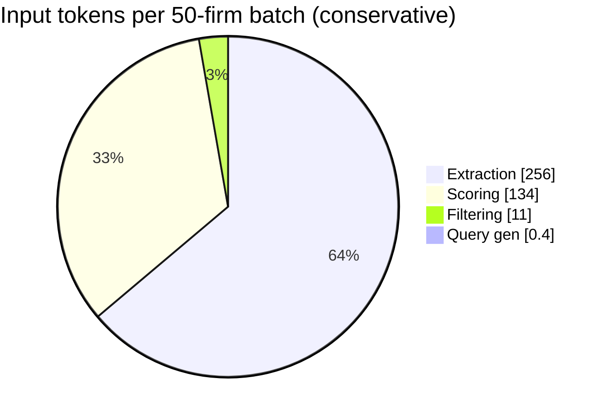

# Cost Analysis

What a real run costs, where the money goes, and an honest read on the
`< $0.25 / 50 firms` target in `CLAUDE.md`. Scope: **v1** (discover → scrape →
extract → score). The v2 email layer is discussed qualitatively at the end, with
no speculative token math.

Pricing verified **May 2026**. LLM and search rates change — re-check before
quoting these figures.

| Item | Rate |
|---|---|
| Groq `llama-3.3-70b-versatile` (prod) | $0.59 / 1M input, $0.79 / 1M output |
| Groq `llama-3.1-8b-instant` (cheaper alt) | $0.05 / 1M input, $0.08 / 1M output |
| Ollama (local dev) | free |
| Tavily | 1,000 credits/mo free; then $0.008/credit (basic search = 1, advanced = 2); failed extractions not charged |

## Summary

For a 50-firm batch on **Groq 70b**, expect roughly:

| Scenario | Groq LLM cost |
|---|---|
| Typical (80% scrape, 50% gate-pass, ~3k-token pages) | **~$0.14** |
| Conservative (80% / 50%, pages at the 6k-token cap) | **~$0.25** |
| Worst case (100% scrape, 100% gate-pass, cap pages) | **~$0.41** |

On **Groq 8b-instant** the same batch is **~$0.02–$0.04** (≈12× cheaper, lower
extraction/scoring quality). **Tavily** search adds **~$0.22–$0.35 per run** on
pay-as-you-go, or is free within the 1,000-credit monthly tier (~20–45 runs/month).

**Verdict on `< $0.25 / 50 firms`:** it holds for *typical* runs but is **not
guaranteed** — high gate-pass rates and large pages push Groq cost to ~$0.30–$0.41.
See [Honest assessment](#honest-assessment).

## Where the pipeline spends money

Two independent meters: **LLM tokens** (Ollama/Groq) and **Tavily credits**.
Scraping itself costs only bandwidth. LLM calls by stage:

| Stage | When it fires | Calls per 50-firm batch* |
|---|---|---|
| Query generation | once per run (only if `--augment`) | 1 |
| Candidate filtering | batched ~10 candidates/call, run-level | ~8 |
| **Extraction** | **once per scraped firm** | **~40** |
| **Scoring** | once per **gate-passing** firm (batched 6 signals) | **~20** |

\* Assumptions: 50 candidates added, 80% scrape success → 40 scraped, 50% hard-filter
pass → 20 scored. Extraction runs *before* the scoring gate, so it fires for every
scraped firm — which is why it dominates cost.

The scoring gate short-circuits: a firm failing the hard filters is disqualified
*without* an LLM call (`scorer.score_firm`), so the 20 gate-failures cost nothing to
score.

## Token estimates per call

Using ~4 characters/token. The scraper caps `combined_text` at **24,000 chars ≈
6,000 tokens** (`_MAX_TOTAL_CHARS`), so that is the per-call ceiling; real pages
are often smaller.

| Call type | Input tokens | Output tokens |
|---|---|---|
| Query generation | ~0.4k (ICP + templates) | ~0.15k |
| Candidate filter (per batch of 10) | ~1.4k (10 × url+title+snippet, snippet capped 300 chars) | ~0.3k |
| Extraction (per firm) | ~0.4k overhead + combined_text → **~6.4k at cap** | ~0.2k |
| Scoring (per firm) | ~0.7k (system + 6 signal prompts) + combined_text → **~6.7k at cap** | ~0.12k |

`combined_text` is the cost driver: it is sent in full to *both* extraction and
scoring.

## Per-batch math (50 firms, Groq 70b)

**Conservative scenario** (80% scrape, 50% gate-pass, pages at the 6k cap):

```
query gen :   1 × 0.4k                =   0.4k in   +   0.15k out
filter    :   8 × 1.4k                =  11.2k in   +   2.4k  out
extraction:  40 × 6.4k                = 256.0k in   +   8.0k  out
scoring   :  20 × 6.7k                = 134.0k in   +   2.4k  out
                                       ----------       ----------
total                                  ≈ 401.6k in   ≈ 13.0k out

input  : 0.4016M × $0.59 = $0.237
output : 0.0130M × $0.79 = $0.010
                                  total ≈ $0.247
```

**Sensitivity** (same arithmetic, different inputs):

| Scenario | Scrape / gate | Page size | Input tokens | Groq 70b | Groq 8b |
|---|---|---|---|---|---|
| Typical | 80% / 50% | ~3k tok | ~221k | **~$0.14** | ~$0.012 |
| Conservative | 80% / 50% | 6k cap | ~402k | **~$0.25** | ~$0.021 |
| Worst case | 100% / 100% | 6k cap | ~666k | **~$0.41** | ~$0.035 |

Where the input tokens go in the conservative scenario:



Extraction + scoring are ~97% of spend; discovery is rounding error.

## Tavily search cost

Searches are issued per generated query (`templates × geo_focus`, plus ~8 if
`--augment`), independent of `--limit`:

| ICP | Expanded queries | + augment | Credits (basic) | Pay-as-you-go |
|---|---|---|---|---|
| `icp_law_boutique` | 20 (4 × 5) | ~28 | 28 | ~$0.22 |
| `icp_cpa_firm` | 36 (6 × 6) | ~44 | 44 | ~$0.35 |

So on pay-as-you-go, **Tavily can cost as much as the LLM stages combined**. The
free tier (1,000 credits/month) covers roughly **20–45 runs/month**. The
`search_cache` table means re-running the same ICP's queries within the TTL is free
(no re-charge), so iteration and resumes don't re-spend credits.

## Model choice: 70b vs 8b

| | 70b (prod default) | 8b-instant |
|---|---|---|
| Cost / 50-firm batch | ~$0.14–$0.41 | ~$0.02–$0.04 |
| Extraction reliability | high | weaker on messy pages |
| Soft-signal judgment | nuanced | coarser |

70b is the configured production model because extraction (structured JSON from
arbitrary firm sites) and soft-signal calibration are quality-sensitive. 8b is a
viable cost floor for high-volume, lower-stakes sweeps.

## Dev vs prod vs v2 routing

- **Dev — Ollama (local, free).** `LLM_PROVIDER=ollama`, `llama3.1:8b`. Zero
  marginal cost, full privacy, deterministic enough for iteration and the eval
  harness. Slower and lower quality, but free is the point.
- **Prod — Groq 70b (cheap, fast).** Production batches run on Groq; the numbers
  above show why a 50-firm run is cents, not dollars.
- **v2 — Claude Sonnet (quality-sensitive, not built).** The deferred email layer
  (drafting, personalization, reply handling) is where output quality is
  customer-facing, so it would route to a stronger model (Claude Sonnet) rather
  than the discovery/scoring models. No token math here — it's out of v1 scope and
  the workload (a few hundred tokens per drafted email) is unlike the
  scrape-text-heavy discovery pipeline. The single `llm.py` adapter makes adding a
  third provider/tier a config change, not a rewrite.

## Cost levers

Pull these when cost matters:

- **Hard-filter gate (already on).** Disqualified firms skip the scoring LLM call.
  In the conservative scenario that saves 20 × 6.7k ≈ 134k input tokens (~$0.08).
  Tighter, cheaper hard filters = lower spend.
- **`--no-augment`.** Skips the query-gen call *and* the ~8 extra Tavily searches
  (~$0.06 of credits) — useful for deterministic eval runs.
- **Caching.** `scrape_cache` and `search_cache` make resumes and re-runs largely
  free; resume also reuses the persisted extracted profile, skipping re-extraction.
- **Model downgrade.** 70b → 8b is ~12× cheaper for volume sweeps.
- **Groq Batch API + prompt caching (available, not used in v1).** Groq's Batch API
  is a clean ~50% discount; prompt caching stacks further on the shared system/schema
  prefix — together Groq advertises roughly **25% of on-demand cost**. The catch:
  most of our input is the *per-firm* `combined_text`, which is unique and not
  cacheable, so prompt caching's reach is bounded to the small static prefix. Batch
  API alone (~50% off, with async latency) would roughly halve the figures above.
  Neither is wired up in v1 — a clear future optimization.

## Honest assessment

The `CLAUDE.md` target — *"Per-batch cost on paid Groq tier: under $0.25 for 50
firms"* — is **achievable but optimistic as a hard ceiling**:

- It holds comfortably in the **typical** case (~$0.14) and lands right at the line
  in the **conservative** case (~$0.25).
- It **breaks** under high gate-pass rates and large pages (**up to ~$0.41**),
  because extraction fires for every scraped firm at up to 6k tokens each.

**Recommendation (for maintainer decision — not changed here):** restate the
`CLAUDE.md` cost target as a range rather than a single ceiling, e.g. *"~$0.15–$0.25
typical, up to ~$0.40 worst-case for 50 firms on Groq 70b; Batch API/8b cut this
substantially."* The `< $0.25` figure is a reasonable *typical* expectation but
shouldn't be quoted as a guarantee.

The companion claim — *"Tavily and Groq free tiers sufficient for dev and 50-firm
batches"* — holds: Ollama dev is free, and Tavily's 1,000-credit tier covers tens of
runs per month.

## See also

- [ARCHITECTURE.md](ARCHITECTURE.md) — where each LLM call is made in the pipeline.
- [DECISIONS.md](DECISIONS.md) — ADR-002 records the gate short-circuit and caching
  as deliberate design choices.
